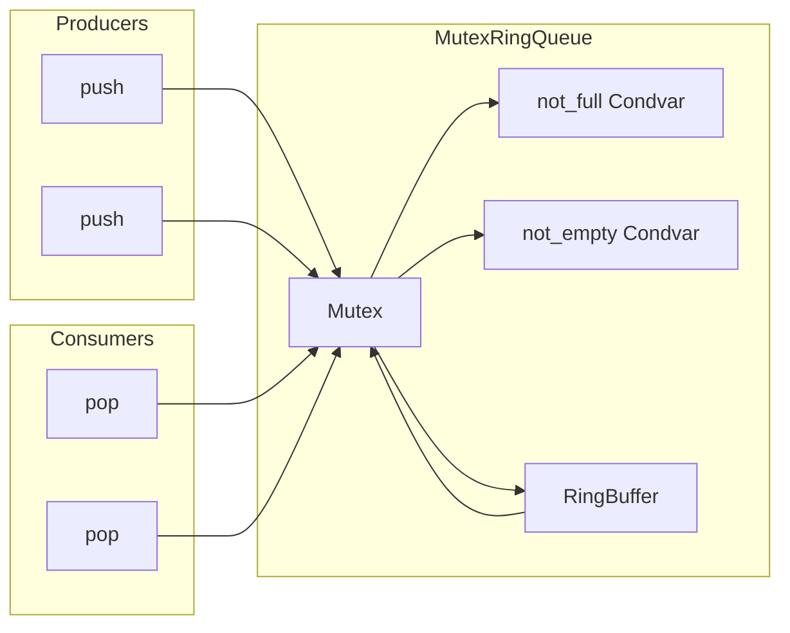
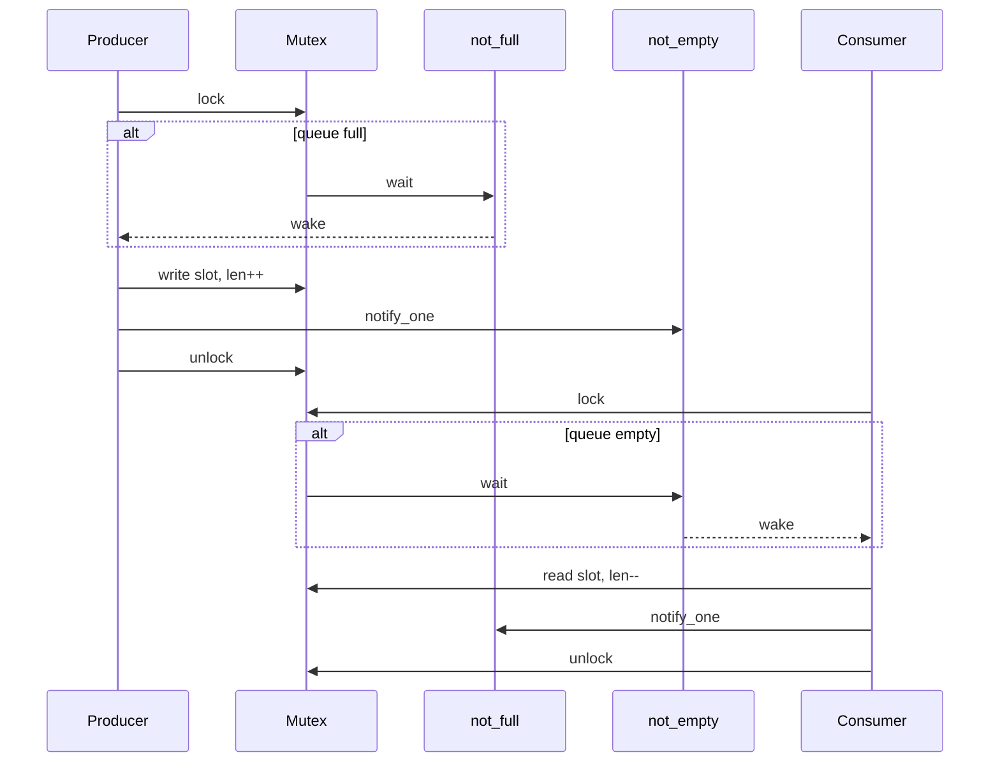

# Bounded MPMC Queue

A bounded, multi-producer multi-consumer (MPMC) queue implemented in Rust using only `std`.

## Design

The queue uses a **Mutex + two Condvars + fixed ring buffer** approach:

- A single `Mutex<Inner<T>>` serializes all access to the buffer.
- `not_full` condvar: producers wait here when the buffer is at capacity.
- `not_empty` condvar: consumers wait here when the buffer is empty.
- The buffer is a fixed-size `Vec<MaybeUninit<T>>` with `head` and `len` indices for O(1) ring-buffer push/pop.



### Push / Pop flow



## Design rationale

### Why Mutex + Condvar?

- **Correctness first**: A single mutex serializing all buffer access is the simplest model to reason about for a bounded MPMC queue. No ABA problems, no memory ordering subtleties, no torn reads.
- **Blocking semantics are natural**: The assignment requires `push` to block when full and `pop` to block when empty. Condvars map directly to this — `wait` releases the lock and sleeps atomically, avoiding lost wakeups.
- **`std`-only constraint**: Lock-free MPMC queues typically rely on `crossbeam-epoch` or similar for safe memory reclamation. Building that from scratch in `std` is a significant correctness risk for the scope of this assignment.

### Tradeoffs vs lock-free

| Property | Mutex + Condvar | Lock-free ring |
|---|---|---|
| Latency (uncontended) | ~50-100ns (syscall if contended) | ~10-30ns (CAS loop) |
| Latency (contended) | Degrades to OS scheduler granularity | Degrades to CAS retry storms |
| Throughput scaling | Drops with thread count (single lock) | Better up to core count, then plateau |
| Correctness risk | Low (well-understood pattern) | High (ABA, memory ordering, reclamation) |
| Fairness | OS scheduler decides (reasonably fair) | No guarantee (CAS starvation possible) |

### When this design breaks

- **High thread counts on a hot path**: With 16+ threads contending on one mutex, throughput degrades significantly (benchmarks show ~536K ops/s at 16 pairs vs ~1.2M at 1 pair with cap=64). The mutex becomes the serialization bottleneck.
- **Latency-sensitive microsecond paths**: Mutex acquisition involves a syscall when contended (`futex` on Linux). For sub-microsecond requirements, a lock-free design or sharded queues would be necessary.
- **Asymmetric workloads**: The 8P/1C benchmark shows throughput bottlenecked by the single consumer (~500K ops/s regardless of capacity), because all 8 producers contend for the same lock the consumer holds.

### What I would change for production low-latency

1. **Lock-free bounded ring** (Vyukov-style): per-slot sequence counters, `AtomicUsize` head/tail with CAS, no mutex. Eliminates syscall overhead entirely.
2. **Cache-line padding**: Separate head and tail into different cache lines to avoid false sharing between producers and consumers.
3. **Batch operations**: Amortize synchronization cost by pushing/popping multiple items per lock acquisition (or per CAS round).
4. **Sharding**: Multiple queues behind a distributor to reduce contention at high thread counts.

## Trait

```rust
pub trait BoundedQueue<T: Send>: Send + Sync {
    fn new(capacity: usize) -> Self where Self: Sized;
    fn push(&self, item: T);          // blocks if full
    fn pop(&self) -> T;               // blocks if empty
    fn try_push(&self, item: T) -> Result<(), T>; // Err(item) if full
    fn try_pop(&self) -> Option<T>;   // None if empty
}
```

## Project structure

```
├── Cargo.toml                 # Library crate; criterion as dev-dependency only
├── src/
│   ├── lib.rs                 # BoundedQueue trait + re-exports
│   └── mutex_ring.rs          # MutexRingQueue implementation (std only)
├── tests/
│   └── mpmc_queue.rs          # 19 integration tests (contention, blocking, drop, edge cases)
├── benches/
│   └── throughput.rs          # Criterion benchmarks (symmetric + asymmetric workloads)
└── BENCH_RESULTS.md           # Recorded throughput numbers
```

## Constraints

- **Queue implementation**: `std` only — no external crate dependencies.
- **`unsafe`**: Used for `MaybeUninit::assume_init_read()` and `assume_init_drop()` in pop/drop paths. Each block has a justification comment documenting the invariant.
- **Benchmarks/tests**: Use `criterion` as a dev-dependency (not part of the queue).

## Running

```bash
# Run all 19 tests
cargo test

# Run benchmarks (throughput across thread counts, capacities, asymmetric workload)
cargo bench --bench throughput
```

## Tests (19 total)

| Test | What it proves |
|---|---|
| `single_thread_try_semantics` | `try_push`/`try_pop` on full/empty queue |
| `fifo_spot_check_single_producer_single_consumer` | FIFO ordering (10K items) |
| `contention_balance_many_producers_many_consumers` | 8P/8C, no lost/duplicate items (200K total) |
| `capacity_one_single_thread` | Smallest buffer edge case |
| `capacity_one_two_threads` | FIFO with cap=1 under concurrency |
| `fill_drain_single_thread` | Full fill then full drain |
| `multiple_fill_drain_cycles` | Ring head/tail wrapping over 10 cycles |
| `push_blocks_when_full` | `push` blocks; unblocks after `pop` |
| `pop_blocks_when_empty` | `pop` blocks; unblocks after `push` |
| `drop_correctness_items_dropped_on_queue_drop` | Remaining items dropped exactly once |
| `drop_correctness_full_pop` | All-popped items dropped, none leaked |
| `try_push_returns_original_item` | Failed `try_push` returns the exact item |
| `mixed_blocking_and_nonblocking` | `push`/`pop` + `try_push`/`try_pop` interleaved |
| `stress_many_producers_few_consumers` | 16P/2C, sum-based correctness |
| `stress_few_producers_many_consumers` | 2P/16C, count-based correctness |
| `stress_varying_capacities` | Same workload across caps 1, 2, 7, 64, 256, 1024 |
| `large_volume_spsc` | 1M items, sum correctness |
| `zero_sized_type` | Works with `()` (ZST) |
| `concurrent_try_operations_no_deadlock` | 4 try-producers + 4 try-consumers, no deadlock |

## Benchmark dimensions

- **Symmetric pairs**: 1, 2, 4, 8, 16 producer/consumer pairs
- **Capacities**: 64, 256, 1024
- **Asymmetric**: 8 producers / 1 consumer

See [BENCH_RESULTS.md](BENCH_RESULTS.md) for recorded throughput numbers.
